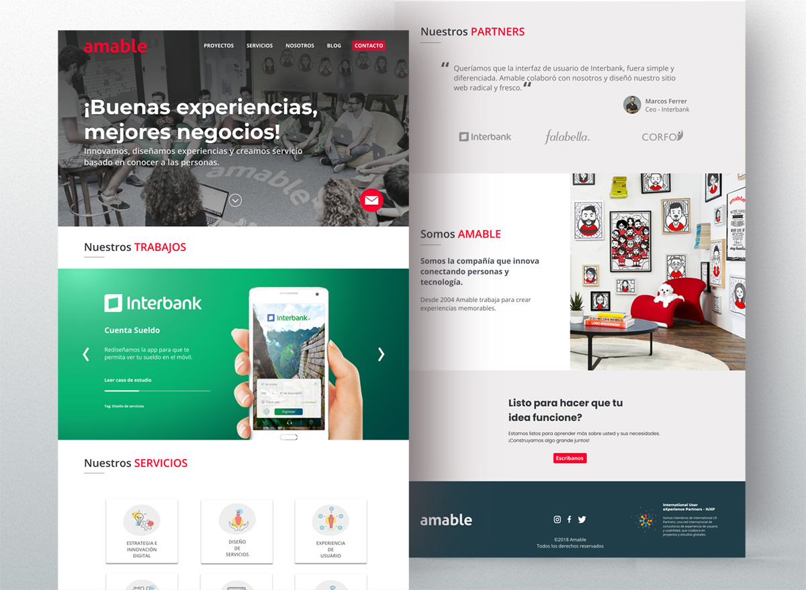

# Rediseño de la web corporativa de Amable

## PRESENTACIÓN: 

 Link de la presentación: [Click aquí para ver ppt ](https://docs.google.com/presentation/d/1pmJXtu1FV9LK7kR7zXG9bcz6c3mDAFd4nfKK0udlMFk/edit?usp=sharing) 

## Preámbulo

[Amable](http://www.amable.com/) es una empresa consultora de Diseño de Experiencia de
Usuario con  presencia en Chile, Ecuador y Perú.

La web corporativa [(www.amable.com)](http://www.amable.com/) requiere una actualización
de emergencia debido a que la versión anterior fue recientemente dada de baja por un hackeo
del servidor. La versión actual es un "parche" temporal rápido, hecho en un par de días,
y que solamente muestra un resumen de lo que es Amable.

## Introducción

Este proyecto te da la oportunidad de resolver un problema 100% real de
una consultora especializada en Diseñar Experiencias de Usuario.

El equipo de Amable Perú ya ha iniciado el _research_ y tiene avances en
_insights_ para el rediseño de la web. El mismo equipo iniciará la
especificación (Arquitectura de Información, Diseño de Interacción,
prototipado, testeo y UI) de la nueva web dentro de las próximas semanas.

### Recursos
En los siguientes links encontrarás información sobre:
- [La empresa](documentos/presentacion_amable.pdf)
- [El consolidado investigación y descubrimiento realizados](documentos/research_web_amable.pdf)

## Objetivos
- Enfrentarse a un proyecto real, con un propósito real y con interlocutores
que cumplirán genuinamente el rol de _stakeholders_ (pues lo son).

- Relacionarse con documentación real de una investigación en Diseño de
Experiencia de Usuario, la cual sería tomada como insumo para continuar
con el proyecto.

- Terminar el ciclo con actividades reales de investigación/validación en campo: prototipado y testeos.

## Consideraciones generales

- Este proyecto se debe "resolver" en equipos de 3.
- El plazo es de 2 semanas.
- Tendrás asesoría de alguien de Amable y a ellos deberás presentar y sustentar tu propuesta
  tu propuesta de solución.

  

